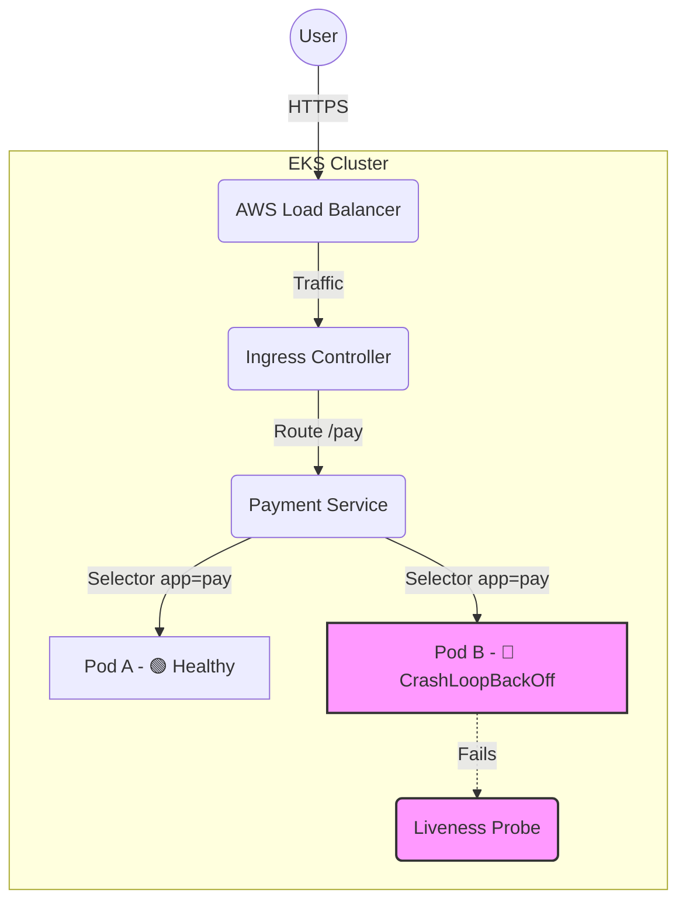

# Case Study: Troubleshooting EKS 502 Bad Gateways

**Scenario:** Production users reported intermittent 502 errors on the payment service.
**Role:** Lead Support Engineer
**Outcome:** Identified misconfigured Liveness Probes causing aggressive pod restarts.

## System Architecture & Failure Point



## The Investigation Process

### 1. Verification
Verifying the 502 error at the Load Balancer level using `curl`:
```bash
curl -I [https://api.production.com/pay](https://api.production.com/pay)
# HTTP/2 502 
```

### 2. Pod Health Check
Checked the status of the pods in the `payments` namespace.
```bash
kubectl get pods -n payments -l app=pay
# NAME                     READY   STATUS             RESTARTS
# pay-7848d4bb4d-abcde     1/1     Running            0
# pay-7848d4bb4d-fghij     0/1     CrashLoopBackOff   15
```

### 3. Log Analysis
Inspected logs for the crashing pod.
```bash
kubectl logs pay-7848d4bb4d-fghij --previous
# [Error] Application failed to connect to DB connection pool (timeout)
```

### 4. Root Cause
The **Liveness Probe** was configured with a timeout of `1s`. The database connection occasionally took `1.5s` during high load, causing Kubernetes to kill the pod thinking it was dead.

### 5. The Fix
Updated the `helm` values to increase the initial delay and timeout thresholds.

```yaml
# values.yaml
livenessProbe:
  httpGet:
    path: /healthz
    port: 8080
  initialDelaySeconds: 30 # Increased from 5
  timeoutSeconds: 5       # Increased from 1
```
